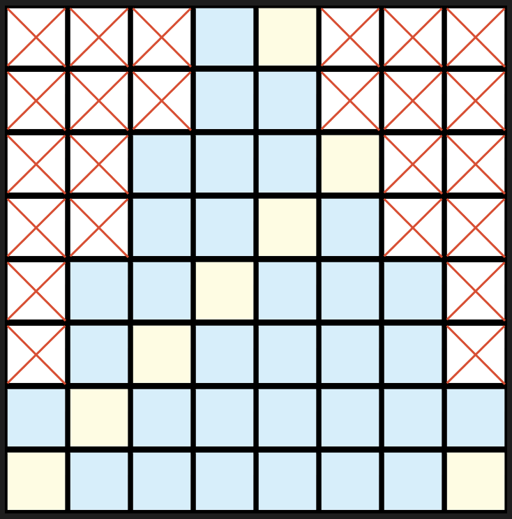
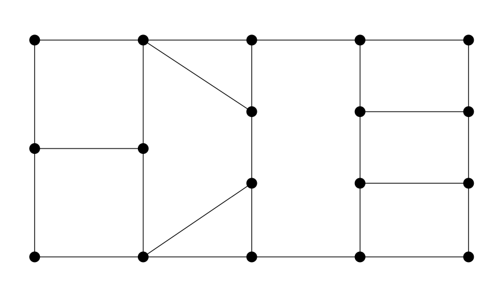
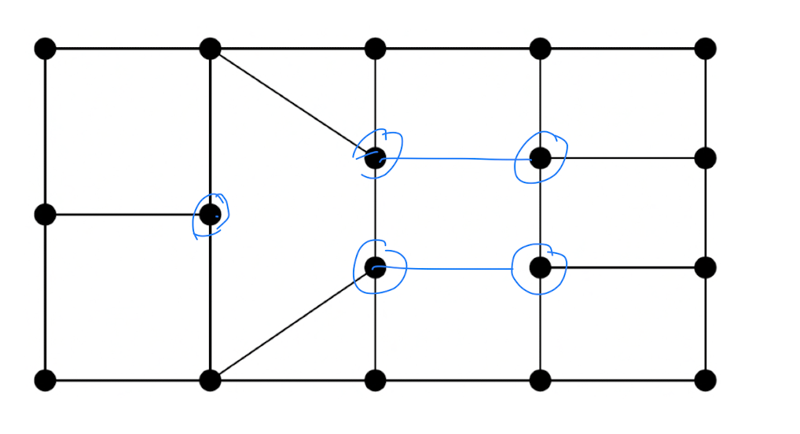

# Mathekalender 2022

## Aufgabe 1
Chocolate Bars: [Aufgabe](1/MK-2022-Raharinirina-ChocolateBars-en.pdf)

## Aufgabe 2
Arrowmatics: [Aufgabe](2/02%20Arrowmatics%20%E2%80%93%20Mathekalender.pdf)
```
a=10, b=15, c=40, d=80
a=10, b=20, c=40, d=75
a=10, b=25, c=40, d=70
a=10, b=30, c=40, d=65
a=10, b=35, c=40, d=60
```
Es gibt 5 Möglichkeiten

## Aufgabe 3
Chit-chat in the Workshop: [Aufgabe](3/MK-2022-Paul-Wichtel-en.pdf) 

Wahrscheinlichkeiten:
```
1* 1/2 * 2/3 * ... * 11/12 = 1/12
```
Zweite Teilaufgabe  
Wahrscheinlichkeiten: 
```
1+1/2+...+1/12 =  3.1 ~ 3
```
## Aufgabe 4
Shipping Presents: [Aufgabe](4/MK-2022-Stegehuis-Presents-en.pdf)

[Beweis](4/beweis.md) 

## Aufgabe 5
Lights On: [Aufgabe](5/MK-2022-Weedage-LightsOn-en.pdf)

Eine Lösung mit sieben Vergleichen ist: 
0-1,1-2,2-0, 3-4,4-5,5-3, 6-7 die Reihenfolge ist egal und wird durch den folgenden Graph ausgedrückt:


[Programm zum Berechnen der Strategie ](5/bf.py) und zum Nachweis, dass es keine Lösung mit 5 Vergleichen gibt.
[Beschreibung Algorithmus](5/description.md)
### Erklärung zur Lösung

In den Dreierklicken kann maximal eine rote Lampe vorhanden sein, in der zweierklicke ebenfalls. Bei 4 roten Lampen ist mindestens eine dieser Bedingungen verletzt.

## Aufgabe 6
Wuthering Roads: [Aufgabe](6/MK-2022-Luecke-Heimweg-en.pdf)

[Programm](6/run.py)

## Aufgabe 7
Gift Cube: [Aufgabe](7/MK-2022-Schritt-Geschenkewuerfel-en.pdf)


Man kann sich leicht überlegen, dass die Seiten des Würfels alle wie A und B oder Rotationen von A und B aussehen.

Folgende Überlegung zur Anzahl von Würfeln:
Ein grüner Würfel in einer Ecke muss auf genau drei Seitenflächen vorkommen, deshalb können wir auf jeder Seitenfläche für jedes Eckquadrat 1/3 zählen. In der Mitte einer Seitenfläche zählen wir 1/2 weil jeder Mittel-Rand-Würfel auf genau zwei Flächen vorkommen muss. Das Mittelquadrat zählt einfach.

Angenommen wir können eine Würfel bilden der auf allen Seitenflächen wie A aussieht dann haben wir 
6 * 2 2/3 = 16 grüne Päckchen. Weniger geht nicht.

Angenommen wir können einen Würfel bilden der nur
aus Seitenflächen B besteht und wir wählen den Würfel in der Mitte des Kubus, der nicht auf einer Seitenfläche sichtbar ist als grünen Würfel, dann haben wir 1 + 6*3 = 19 grüne Päckchen , mehr geht nicht.

Damit sind wir eigentlich schon fertig, es müssen auf jeden Fall 16 oder mehr und 19 oder wenige grüne Päckchen sein - alle anderen Lösungen machen keinen Sinn.

Man müsste jetzt eigentlich noch zeigen, dass es auch möglich ist eine reale Päckchenkombination mit den Flächen A und B zu erzeugen. Man sieht das leicht hier (und könnte natürlich auch hier einfach zählen und kommt auf dieselben Zahlen):

### Würfel mit nur Flächen von Typ A


### Würfel mit nur Flächen von Typ B
tbd

### Link auf Brute Force Programm
[Programm](7/wuerfel.py)
### Lösung
```
16 <= # gruene Päckchen <= 19
```
## Aufgabe 8
The Canal: [Aufgabe](8/MK-2022-Karsai-Canal-en.pdf)

[Notizen](8/8.md)

# Aufgabe 9
Wish List Optimizationd: [Aufgabe](9/MK-2022-KK-Wunschzettel-en.pdf)

Antowrt Nr. 7: [Programm](9/9.py)

# Aufgabe 10
Elections at the North Pole: [Aufgabe](10/MK-2022-Junker-Wahlen-en.pdf)
# Aufgabe 11
Heisshunger: [Aufgabe](11/MK-2022-HS-Heisshunger-de.pdf)

Lösung: Nr. 4 [Rechnungen dazu](11/mathe-advent-wahrscheinlichkeiten.pdf)
# Aufgabe 12

# Aufgabe 13
Schokoladenspiel: [Aufgabe](13/MK-2022-PR-Schokoladenspiel-de-1.pdf)

Lösung: Nr 10. [Programm zur Simulation mit min-max](13/board.py)

Empirisch: Lösung Nr. 10

Strategie für quadratische Felder ist klar, für 2xn Felder auch

Allgemeine Strategie noch nicht beschreibbar - Simulation findet win Situation für Felder kleiner als 6x4 rechnerisch gerade noch möglich, danach dauert es zu lange
(evtl. noch Programm auf dynamische Programmierung umstellen)

Interessant ist hier die [Musterlösung](MK-2022-Loesungen-de.pdf) mit einem Widerspruchsbeweis, der beweist wann es eine Strategie gibt ohne sie allerdings zu beschreiben. Nach dem Wissenstand der Autoren hat noch niemand den Algorithmus für die Strategie angeben können.


# Aufgabe 14
Rentiere im Gehege: [Aufgabe](14/MK-2022-KH-ReindeerBreeding-de-1.pdf)

Lösung: Nr. 9

# Aufgabe 15
Verlorene Wunschzettel: [Aufgabe](15/MK-2022-Griesbach-Wunschzettel-de.pdf)

Lösung: Nr. 9, [Programm](15/15.py)

Ausgabe des Programms:
```
2535 ['0-1,t:10,c:250', '1-6,t:17,c:250', '6-5,t:25,c:1500', '1-2,t:37,c:2055', '0-4,t:47,c:2055', '4-3,t:48,c:2535']
```
D.h. mit dem angegebenen Weg haben wir im Durchschnitt 25.35 Stunden.

# Aufgabe 16
Weihnachtsbaum: [Aufgabe](16/MK-2022-BW-Weihnachtsbaum-de.pdf)

Lösung: Nr 3 = 8 Lichter müssen angemacht werden.

Rechnerische Lösung [Prog](16) von der Komplexität für 6,7 oder 8 Züge zu komplex (rechnerisch aufwändig)
Begründung: 
Folgendes Skizze zeigt eine Lösung:



Beweisidee, dass nichts besseres möglich ist:

Angenommen die ausgefüllten Felder bedecken ein nxm Rechteck. Durch ein zusätzliches Licht kann entweder ein n+1 x m+1 Rechteck gefüllt werden oder man kann ein n x m+2 oder n+2 x m Rechteck füllen. Da man in beide Richtungen 8 Felder benötigt sind dann 8 Lichter nötig - aber was wenn man teilflächen verbindet...

# Aufgabe 17
## Rüpelhafte Rentiere
[Aufgabe](17/MK-2022-Rhijn-Reindeer-de.pdf)



Lösung: 6 Möglichkeiten -> Nr. 5


## Grundidee



Jeder der eingekreisten Knoten hat eine ugerade Anzahl von wegführenden Kanten benötigt aber eine gerade Anzahl (so dass die angrenzenden Flächen jeweils abwechslend mit rot braun "gefärbt" werden können). Wir haben also 5 Kantenenden und benötigen 3 Kanten. Man kann sich dann durchüberlegen, dass es dann 6 Möglichkeiten gibt, die zu einer zulässigen Lösung führen (3 Möglichkeiten und deren Spiegelungen)
# Aufgabe 18
Auf und ab: [Aufgabe](18/MK-2022-Hercher-Zahlenspiel-de.pdf)
 
Lösung: Nr. 8

Aussage a ist richtig. Siehe auch [Programm](18/18.py)

Aussage d ist falsch: Für den i-ten  Schritt muss n_i so stark wie eine Zweierpotenz wachsen, es wächst aber nur um den Faktor 1.5 + konstante, d.h. es geht nicht auf Dauer.

# Aufgabe 19
Der Weihnachtsmann braucht Optimalen Transport: [Aufgabe](19/MK-2022-Altekrueger-OptimalTransport-de.pdf)

[Programm](19/19.py) auf Basis von pytorch mit Gradientenabstieg.

Man findet durch Gradientenabstieg mehrere Minima, unter anderem:
```
    L1   L2   L3   L4   L5   L6
F1 100  325    0    0   75    0 
F2   0    0    0    0  125  275 
F3   0  125  300  400    0   75  
```
und erhält 8150 Stunden.

-> Nr. 8
Allerdings ohne Beweis, dass es nichts besseres gibt.

Bemerkung: Simplex liefert dieselbe Lösung.
Hier das Programm von Stefan für glpk:
```
set F;                      /* factories Fi                     */
set W;                      /* warehouses Wj                    */
param p{i in F};            /* loads of presents produced in Fi */
param m{j in W};            /* loads of presents missing in Wj  */
param d{i in F, j in W};    /* duration flight Fi to Wj         */
var x{i in F, j in W} >= 0, integer;
minimize duration: sum{i in F, j in W} d[i,j] * x[i,j];
s.t. produced{i in F}: sum{j in W} x[i,j] <= p[i];
s.t. missing{j in W}: sum{i in F} x[i,j] >= m[j];

data;

set F := F1 F2 F3;
set W := W1 W2 W3 W4 W5 W6;
param p := F1 500     
           F2 400     
           F3 900     ;
param m := W1 100     
           W2 450     
           W3 300     
           W4 400     
           W5 200     
           W6 350     ;
param d :     W1 W2 W3    W4    W5 W6 :=
           F1 2  4  10000 10000 5  8
           F2 7  8  8     11    3  5
           F3 8  6  5     4     9  9 ;
end;

```
# Aufgabe 20
Das Eisphone [Aufgabe](20/MK-2022-Beier-EisPhone-de.pdf)

# Aufgabe 23
Robin Hoods neue Pfeile: [Aufgabe](23/MK-2022-Sevenster-Quiver-de.pdf)

[Skizze](23/23.pdf)

# Aufgabe 24
Beier Dreieck: [Aufgabe](24/MK-2022-Beier-Dreieck-de.pdf)

[Skizze](24/24.pdf)

Lösung: Nr. 10

[Skizze](24/24.pdf) und Herleitung.

Achtung: Ein Programm, das mit Gleitkomma rechnet liefert 0.9999.. als Lösung: [Programm](24/24.py)

Erst durch symbolische Berechnung erhält man die korrekte Lösung. Hier mit sympy: [Programm](24/24_sympy.py)

## Lösungen

[Link auf pdf mit Lösungen](MK-2022-Loesungen-de.pdf)