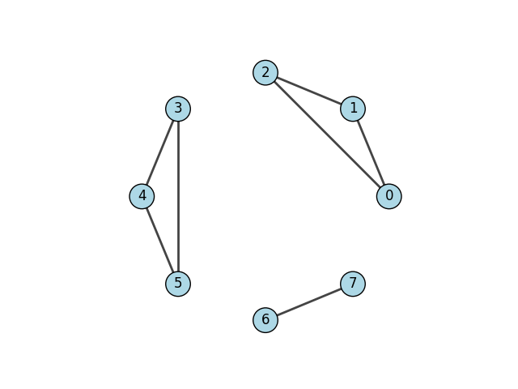
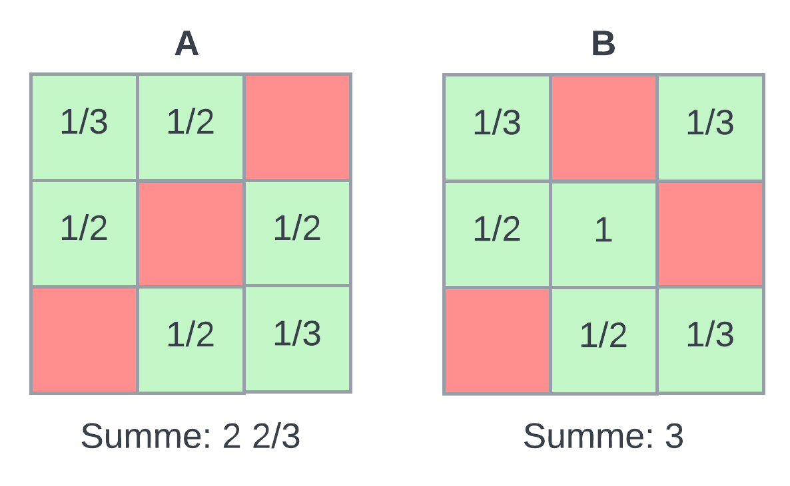
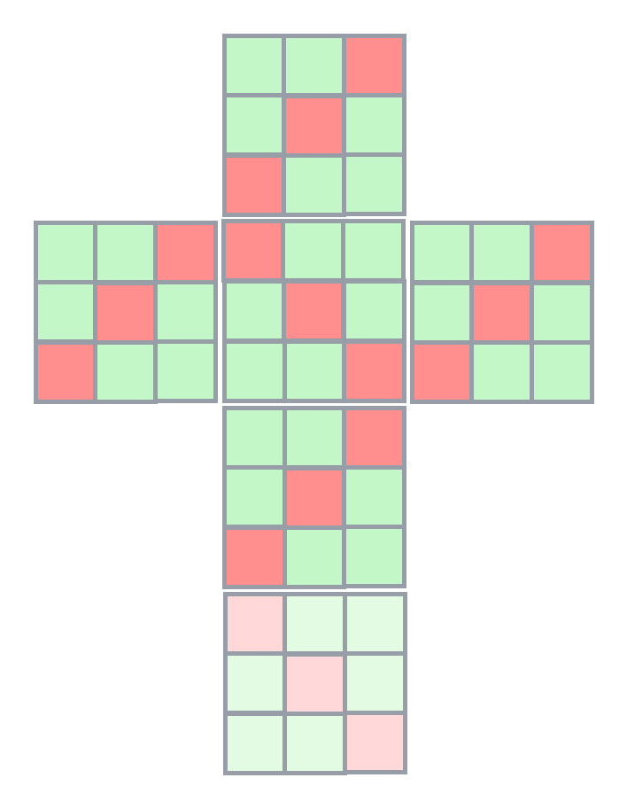
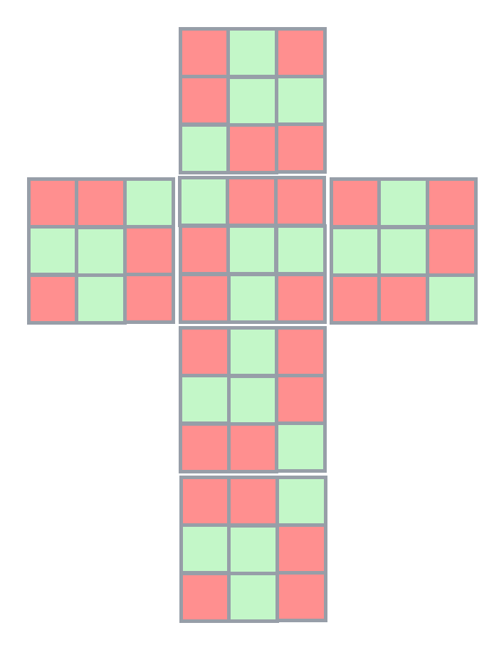

# Mathekalender Klasse 10+ 2022

## Aufgabe 1
mit Blatt Papier gelöst

## Aufgabe 2
Brute force durchprobiert in python:
```
a=10, b=15, c=40, d=80
a=10, b=20, c=40, d=75
a=10, b=25, c=40, d=70
a=10, b=30, c=40, d=65
a=10, b=35, c=40, d=60
```
Es gibt 5 Möglichkeiten

## Aufgabe 3
Erste Teilaufgabe  
Wahrscheinlichkeiten:
```
1* 1/2 * 2/3 * ... * 11/12 = 1/12
```
Zweite Teilaufgabe  
Wahrscheinlichkeiten: 
```
1+1/2+...+1/12 =  3.1 ~ 3
```
## Aufgabe 4
[Beweis](4/beweis.md) 

## Aufgabe 5
Eine Lösung mit sieben Vergleichen ist: 
0-1,1-2,2-0, 3-4,4-5,5-3, 6-7 die Reihenfolge ist egal und wird durch den folgenden Graph ausgedrückt:

[Programm zum Berechnen der Strategie ](5/bf.py) und zum Nachweis, dass es keine Lösung mit 5 Vergleichen gibt.
[Beschreibung Algorithmus](5/description.md)
### Erklärung zur Lösung

In den Dreierklicken kann maximal eine rote Lampe vorhanden sein, in der zweierklicke ebenfalls. Bei 4 roten Lampen ist mindestens eine dieser Bedingungen verletzt.

## Aufgabe 6
[Programm](6/run.py)

## Aufgabe 7

Man kann sich leicht überlegen, dass die Seiten des Würfels alle wie A und B oder Rotationen von A und B aussehen.

Folgende Überlegung zur Anzahl von Würfeln:
Ein grüner Würfel in einer Ecke muss auf genau drei Seitenflächen vorkommen, deshalb können wir auf jeder Seitenfläche für jedes Eckquadrat 1/3 zählen. In der Mitte einer Seitenfläche zählen wir 1/2 weil jeder Mittel-Rand-Würfel auf genau zwei Flächen vorkommen muss. Das Mittelquadrat zählt einfach.

Angenommen wir können eine Würfel bilden der auf allen Seitenflächen wie A aussieht dann haben wir 
6 * 2 2/3 = 16 Würfel. Weniger geht nicht.

Angenommen wir können einen Würfel bilden der nur
aus Würfeln B besteht und wir wählen den Würfel in der Mitte des Kubus, der nicht auf einer Seitenfläche sichtbar ist als grünen Würfel, dann haben wir 1 + 6*3 Päckchen = 19, mehr geht nicht.

Damit sind wir eigentlich schon fertig, es müssen auf jeden Fall 16 oder mehr und 19 oder wenige grüne Päckchen sein - alle anderen Lösungen machen keinen Sinn.

Man müsste jetzt eigentlich noch zeigen, dass es auch möglich ist eine reale Päckchenkombination mit den Flächen A und B zu erzeugen. Man sieht das leicht hier (und könnte natürlich auch hier einfach zählen und kommt auf dieselben Zahlen):

### Würfel mit nur Flächen von Typ A
 

### Würfel mit nur Flächen von Typ B


### Link auf Brute Force Programm
[Programm](7/wuerfel.py)
